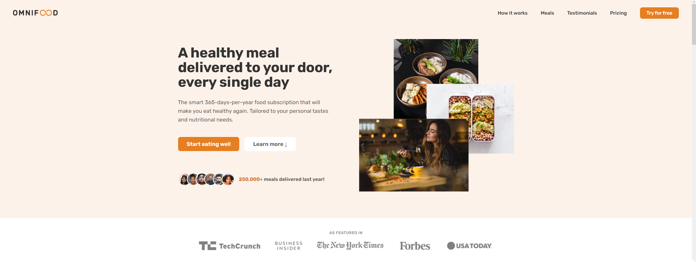
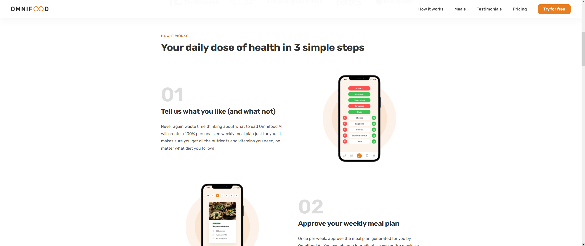
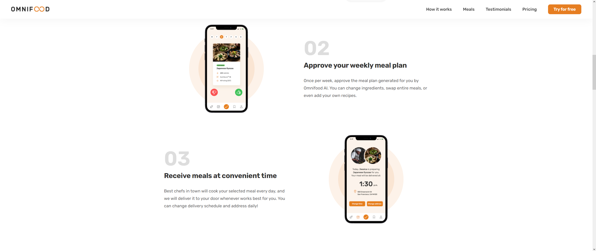
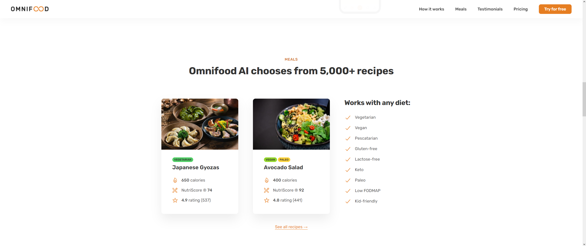
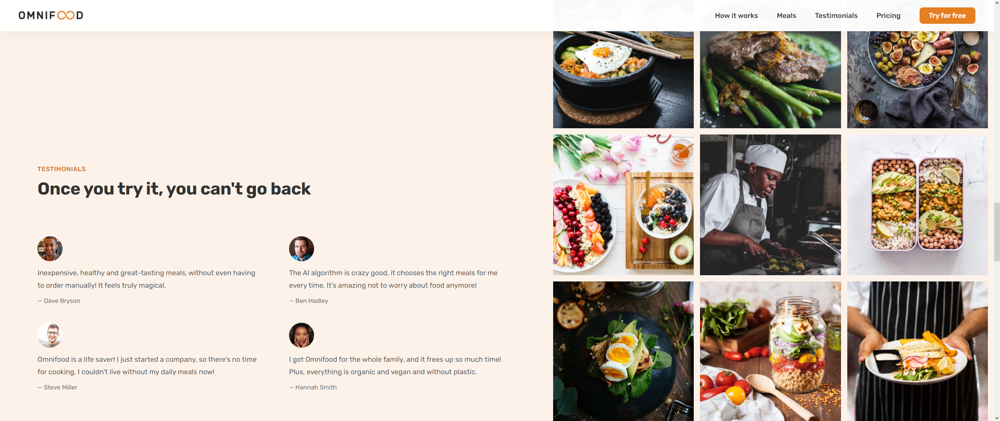
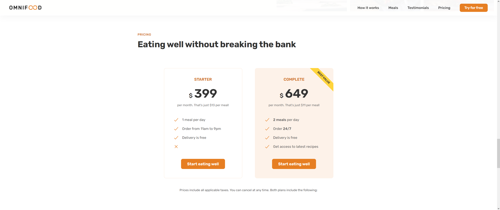
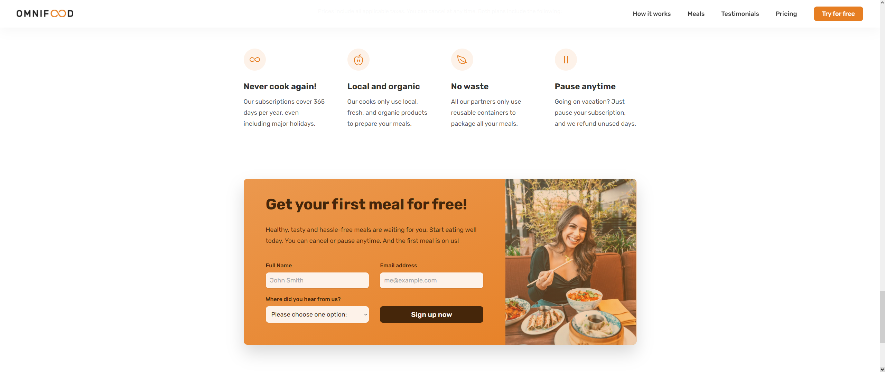
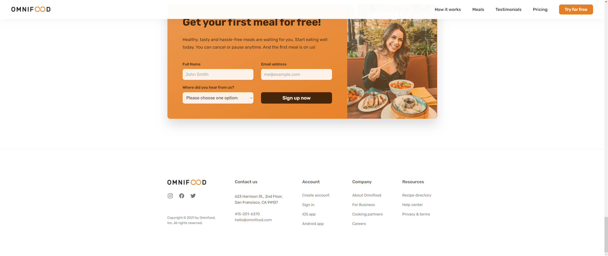

# Website para delivery de comida saudável.

### Esse Website foi o projeto final desenvolvido no curso [Build Responsive Real-World Websites with HTML and CSS](https://www.udemy.com/course/design-and-develop-a-killer-website-with-html5-and-css3/)
### Para visualizar o site [Clique aqui](https://omnifood-lucas.netlify.app)

### — Hero

### — How it works

### — Meals

### — Testimonials

### — Pricing

### — Form

### — Footer

## FAQ

### 1) O que aprendi durante o curso ?

Fundamentos do HTML é CSS, Layouts: Float, Flexbox e Grid, regras de web design, padrões de componentes e layouts, responsividade de página, estruturação de código efeitos, otimização de site.

### 2) No que consiste a website ?

Website para delivery de comida saudável, onde você pode visualizar, fotos do aplicativo da empresa, os tipos de pratos e seus ingredientes, testemunhos de clientes e galeria de fotos, os preços para aderir o serviço
e um formulário para entrar em contato

### 3) Posso usar esse projeto ?

Como instruído no curso, esse é um projeto somente para fins de portfólio. **Não é permitido** usar esse projeto para cursos/vídeos/artigos.

